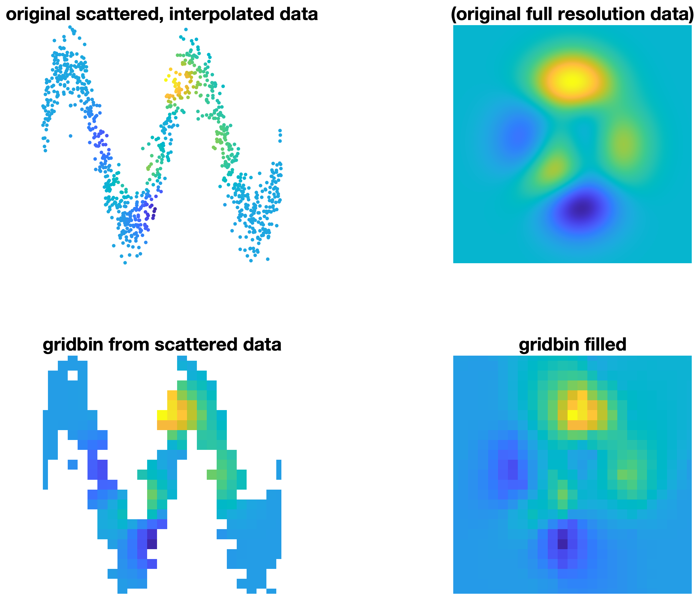

# gridbin
A _fast_ MATLAB function for gridding _very large_ datasets of scattered data. This function is somewhat similar to Matlab's built-in [`griddata`](https://www.mathworks.com/help/matlab/ref/griddata.html) or John D'Errico's [`gridfit`](https://www.mathworks.com/matlabcentral/fileexchange/8998), with the differences being that 

1. `gridbin` does not interpolate or fit any type of surface. Rather, **_`gridbin` just calculates the mean value of all scattered data points_** within every cell of a grid. 
2. **_`gridbin` is much faster_** than `griddata` or `gridfit`.
3. **_`gridbin` can handle much larger scattered datasets_** than `griddata` or `gridfit`.
4. **_`gridbin` can return statistics._** For example, `gridbin` can return the standard deviation of all scattered data points within a grid cell simply by adding `@std` to the function call. 

##  Syntax
```
 vq = gridbin(x,y,v,xq,yq) 
 vq = gridbin(...,@func) 
 [vq,N] = gridbin(...) 
```
## Description

`vq = gridbin(x,y,v,xq,yq)` produces a 2D grid of values vq at the coordinates 
xq,yq. Inputs x,y,v may be scattered data, and the output vq is the mean
of all scattered values v within each spatial bin. 

`vq = gridbin(...,@func)` applies any function @func to the v data. By
default, @func is @mean, meaning that vq contains the mean of all values
v within each spatial bin. 

`[vq,N] = gridbin(...)` also returns a grid N containing the number of
observations v in each bin. 


 